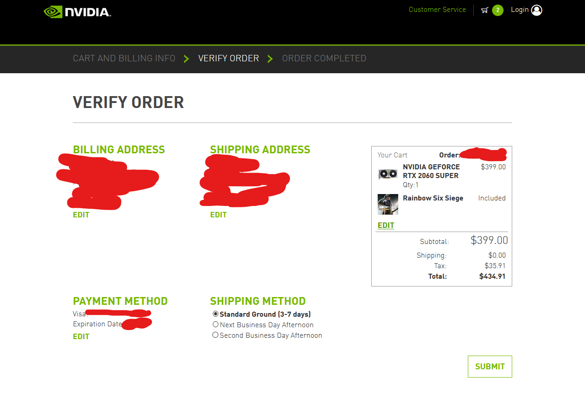

## **[Nvidia Sniper](https://github.com/philippnormann/nvidia-sniper) Install:**

###### **Note:** I am not the creator of Sniper, lots of people needed instructions so I went and made some!

1) Install firefox normally
2) Install [git](https://git-scm.com/download/win):
3) Download [Python 3.8.x **64bit**](https://www.python.org/ftp/python/3.8.5/python-3.8.5.exe) 

### **Install python:**

- Run installer and customize the install
- Hit next
- :ballot_box_with_check: check `add python to environment variables`
- go ahead with the rest of the install

### **Sniper Download/Pipenv Install**

- Go to the directory you want to have sniper located and type ` cd [path to location]` in command prompt.
- Type `git clone https://github.com/philippnormann/nvidia-sniper.git`
- This will create a solder called `nvidia-sniper`
- Open a command window, type:
- ` cd [path to nvidia-sniper folder]` ex: `cd c:/desktop/nvidia-sniper`
- Type `pip install pipenv`
- Wait for this to finish
- Type `pipenv install`
- Wait again
- Type `pipenv install windows-curses`
- Done :white_check_mark: 

### **Sniper Setup** 

- Open to `customer.json` in the `nvidia-sniper/data` folder
- **To stop firefox opening in Dutch,** Change "locale" to your own (`en-us` for USA) This is just for country, not state. Note: this is different from your [country code (alpha 2-code)](https://www.iban.com/country-codes) . **ONLY CHANGE TEXT WITHIN QUOTES" "**
- Save

### **Running Sniper**

Open a command window within the `nvidia-sniper` folder (just like before with `cd c:/....nvidia-sniper`)
- Type: `pipenv run python -m sniper`
- Select the card to monitor, and it'll periodically refresh a webpage in Firefox checking for stock.
- You need to change your info still, but test it first. Move along to the next step for some tricks.

### Adding Info
- Details on adding your personal info can be found [here](https://github.com/philippnormann/nvidia-sniper#configuration) at the creator's repo

- Open customer.json again: 

*ONLY CHANGE TEXT WITHIN QUOTES " "*

- Put in your address. I reccomend leaving your payment info out until you confirm everything is working smoothly.

### Testing
- Select an rtx-2060-super to make sure everything is working. Nvidia will likely suggest a modified address, use that to streamline the process (for example, they prefer `Drive` to be `Dr`). Continue to modify your address in `customer.json` until the suggestion disappears when the bot is run again. If it’s not there in the first place, congratulations, you’ve pleased the gods. Have a cake :birthday:
- Once the process gets to a screen that looks like the screenshot below without interruption, you're all set! Put your payment info in `customer.json` now and get ready for launch!

    
    
### **Updating**

**MOVE any modifed files out of `nvidia-sniper`**(customer.json mainly) THEY WILL GET REMOVED in the update process

- open cmd
- Type ` cd [path to nvidia-sniper]` ex: `cd c:/desktop/nvidia-sniper `
- Type `git pull`
- Exit the window
